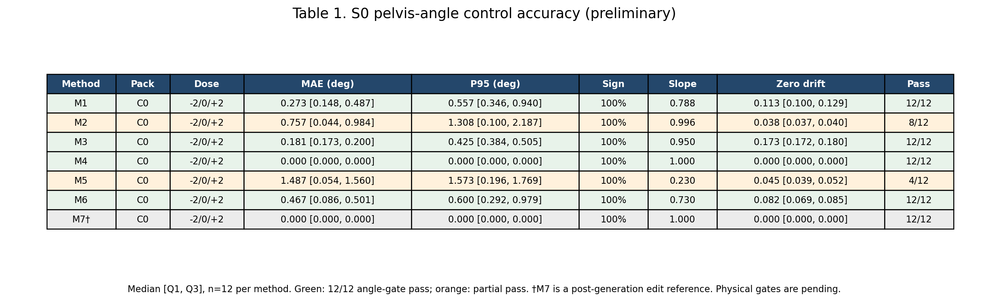
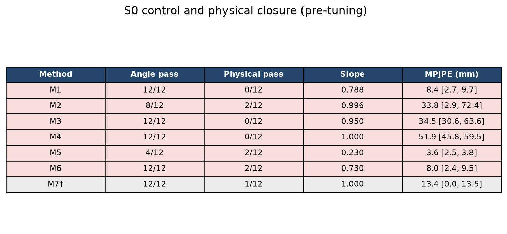

# ViMoGen M1–M7 骨盆控制规模实验

本分支实现并验证 ViMoGen 骨盆姿态控制的 M1–M7 统一比较框架。当前完成的是冻结协议下的 **S0 小规模机制检查**：7 种方法、2 个动作、2 个随机种子和 3 个剂量，共 84 条受控序列。

当前结论不是最终论文结论。S0 已完成角度与内容诊断，但共享脚部标记尚未物化，足部接触、脚滑和地面穿透等物理评价仍为待评估状态。因此现有 Table 1 必须标记为 `PRELIMINARY_S0_ONLY`，不能直接作为最终论文主表。

## 当前状态

- 当前分支：`codex/pelvis-m1-m7-scale-experiments`
- 冻结协议：`vimogen_pelvis_m1_m7_scale_v1`
- 约束包：C0，仅控制局部矢状面骨盆角
- S0 动作：sample94、sample34122
- 随机种子：0、42
- 剂量：−2°、0°、+2°
- 每种方法：12 条序列
- 总序列数：84 条，其中 M1–M6 为 72 条，M7 为 12 条
- 服务器最终完整回归：`324 passed, 1 skipped`
- S0 状态：生成、评价、汇总均已完成；物理门待共享脚部标记物化
- S1/S2 状态：尚未启动

## 研究目标

实验使用统一的动作权威边界、同一骨盆角定义、同一配对 M0、同一剂量和同一评价契约，比较七类控制机制：

| 方法 | 机制 | 当前角色 |
|---|---|---|
| M1 | 采样状态能量引导 | 生成期控制候选 |
| M2 | 源噪声优化 | 完整轨迹可微优化候选 |
| M3 | 局部投影流 | 采样期投影候选 |
| M4 | 前向射击与终端高斯—牛顿校正 | 规划式控制候选 |
| M5 | 原始—对偶流 | 约束优化候选 |
| M6 | 李雅普诺夫伪投影 | 稳定性引导候选 |
| M7 | 生成后几何编辑 | 角度命中参考，不代表生成器自然响应 |

动作表示以身体姿态、根旋转和根平移为直接权威通道；关节、关节速度、根旋转速度和根平移速度均由权威动作重新计算。候选不得从自身重新定义接触帧、地面或目标曲线。

## 本次实施过程

### 1. 冻结公共协议与评价契约

首先建立 `guidance/` 下的统一方法接口，以及 `configs/m1_m7/` 下的公共协议和七种方法配置。协议冻结了：

- 直接与派生动作通道；
- 局部矢状面骨盆角评价器；
- C0–C3 约束包；
- 七档完整剂量与 S0 的 −2°/0°/+2° 子集；
- S0 动作、随机种子和每方法最多 8 组等价调参预算；
- 角度、数值稳定性、物理副作用、内容保持和计算成本的选择顺序。

核心框架提交为 `57a689d`。

### 2. 接入 M1–M7 方法

七种机制分别位于：

- `guidance/m1_loss_guidance.py`
- `guidance/m2_dflow_source.py`
- `guidance/m3_projflow_local.py`
- `guidance/m4_pcfm.py`
- `guidance/m5_ldf.py`
- `guidance/m6_lyaguide.py`
- `guidance/m7_paht_edit.py`

M1、M3、M5、M6 通过统一采样钩子运行；M2 使用可微完整轨迹反传并只优化源噪声；M4 在预定噪声尺度执行剩余轨迹射击和终端求解；M7 读取配对 M0 缓存执行生成后几何编辑。

### 3. 真实服务器冒烟与边界修正

真实 ViMoGen 冒烟中发现并保留了以下问题和修正记录：

- M6 首次运行方向错误，但梯度有限。原因是噪声尺度递减时李雅普诺夫导数符号使用错误；在 `91722a2` 修正后，独立运行通过当前角度门。
- M2 首次运行把标准化动作当作物理动作计算角度，导致方向和全身内容严重错误；在 `951d410` 增加标准化到物理权威动作的边界转换。修正后方向正确，但仍存在过冲和个体不稳定。
- M4 首次运行暴露批上下文、批统计广播和嵌套配置解析问题；分别在 `4d9b292`、`83e9713`、`89ee3ce` 修正。修正后角度可精确命中，但内容副作用仍然存在。

失败尝试均保留在独立 attempt 目录，没有覆盖或选择性删除。

### 4. 可恢复 S0 矩阵运行

`experiments/run_s0_matrix.py` 顺序执行 M1–M6 的 36 个唯一批次，每批包含两个动作。运行器使用方法、随机种子和剂量作为唯一键，保存每次命令、配置、运行状态和评价状态；已完成项可跳过，失败评价可单独恢复。

可恢复运行器和进度修正对应提交：

- `4bb22b6`：增加 S0 矩阵运行器；
- `85048a3`：增加评价恢复能力；
- `2aaa02b`：修正唯一键完成状态统计。

M7 由 `experiments/run_m7_smoke_from_cache.py` 使用两组经过验证的配对 M0 缓存独立生成 12 条序列。最终 S0 共 84 条序列。

### 5. 统一评价与 Table 1

每条序列先经过权威动作重建，再计算：

- 骨盆角平均绝对误差和 P95；
- 非零剂量符号；
- 剂量响应斜率；
- 零剂量漂移；
- 相对 M0 的 22 关节平均位置误差；
- 根平移 P95 偏差；
- 物理评价状态。

`experiments/build_s0_table1.py` 对严格 JSON 结果做完整性检查并生成 Markdown、LaTeX、PNG 和机器可读 JSON。生成器不会把缺失的脚部标记解释为物理门通过。

## S0 预备结果

### 角度控制

| 方法 | 角度 MAE（°）↓ | 角度 P95（°）↓ | 符号正确率↑ | 剂量响应斜率→1 | 零剂量漂移（°）↓ | 序列角度通过率↑ |
|---|---:|---:|---:|---:|---:|---:|
| M1 能量引导 | 0.273 [0.148, 0.487] | 0.557 [0.346, 0.940] | 100.0% | 0.788 | 0.113 [0.100, 0.129] | 12/12 |
| M2 源噪声优化 | 0.757 [0.044, 0.984] | 1.308 [0.100, 2.187] | 100.0% | 0.996 | 0.038 [0.037, 0.040] | 8/12 |
| M3 局部投影 | 0.181 [0.173, 0.200] | 0.425 [0.384, 0.505] | 100.0% | 0.950 | 0.173 [0.172, 0.180] | 12/12 |
| M4 前向射击 | 0.000 [0.000, 0.000] | 0.000 [0.000, 0.000] | 100.0% | 1.000 | 0.000 [0.000, 0.000] | 12/12 |
| M5 原始—对偶流 | 1.487 [0.054, 1.560] | 1.573 [0.196, 1.769] | 100.0% | 0.230 | 0.045 [0.039, 0.052] | 4/12 |
| M6 李雅普诺夫引导 | 0.467 [0.086, 0.501] | 0.600 [0.292, 0.979] | 100.0% | 0.730 | 0.082 [0.069, 0.085] | 12/12 |
| M7 生成后几何编辑† | 0.000 [0.000, 0.000] | 0.000 [0.000, 0.000] | 100.0% | 1.000 | 0.000 [0.000, 0.000] | 12/12 |

数值为每种方法 12 条 S0 序列的中位数 `[Q1, Q3]`。当前序列角度门为 MAE≤1°、P95≤2°，且非零剂量符号正确。†M7 是生成后编辑参考。

### 内容保持诊断

| 方法 | 22 关节 MPJPE vs M0（mm）↓ | 根平移 P95 偏差（mm）↓ | 最大 MPJPE（mm） | 物理门 |
|---|---:|---:|---:|---|
| M1 能量引导 | 8.4 [2.7, 9.7] | 4.5 [4.1, 5.0] | 11.0 | 待评估 |
| M2 源噪声优化 | 33.8 [2.9, 72.4] | 39.3 [5.2, 105.8] | 552.7 | 待评估 |
| M3 局部投影 | 34.5 [30.6, 63.6] | 50.9 [45.5, 93.1] | 148.8 | 待评估 |
| M4 前向射击 | 51.9 [45.8, 59.5] | 88.5 [74.5, 95.8] | 75.7 | 待评估 |
| M5 原始—对偶流 | 3.6 [2.5, 3.8] | 4.4 [3.9, 4.7] | 4.0 | 待评估 |
| M6 李雅普诺夫引导 | 8.0 [2.4, 9.5] | 4.6 [4.1, 4.9] | 10.7 | 待评估 |
| M7 生成后几何编辑† | 13.4 [0.0, 13.5] | 0.0 [0.0, 0.0] | 13.7 | 待评估 |



完整表格与机器可读数据：

- [Markdown 表格](artifacts/table1_s0_preliminary/TABLE1_S0_PRELIMINARY.md)
- [LaTeX 表格](artifacts/table1_s0_preliminary/table1_s0_preliminary.tex)
- [汇总 JSON](artifacts/table1_s0_preliminary/table1_s0_summary.json)
- [PNG 图片](artifacts/table1_s0_preliminary/table1_s0_preliminary.png)

### S0 物理闭环更新

共享 M0 的逐标记点脚跟/脚尖接触、地面和有效帧证据已经物化；物理阈值只由 4 条 paired M0 自评、既有 `M0 + max(5%, 1 mm)` 规则和程序化穿透/离地/滑动扰动冻结，未读取候选方法或 S2 结果。84 条序列现为 `7 EVALUATED_PASS / 77 EVALUATED_FAIL`，各方法物理通过数为 M1 `0/12`、M2 `2/12`、M3 `0/12`、M4 `0/12`、M5 `2/12`、M6 `2/12`、M7 `1/12`。



- [物理闭环 Markdown 表格](artifacts/table1_s0_physical_v1/TABLE1_S0_PHYSICAL.md)
- [物理闭环 LaTeX 表格](artifacts/table1_s0_physical_v1/table1_s0_physical.tex)
- [物理闭环汇总 JSON](artifacts/table1_s0_physical_v1/table1_s0_physical_summary.json)

这张表仍是 S1 调参前诊断表。物理闭环完成不等于方法入围；当前没有方法满足进入 S2 所需的全部条件。

## 结果诊断

### M1 与 M6

两者在当前 ±2° S0 上均通过角度门，内容偏差较小，是当前较稳定的生成期候选。但剂量响应斜率分别为 0.788 和 0.730，提示更大剂量下可能欠响应，仍需在 S1 校准后验证 ±5° 和 ±10°。

### M2

M2 只有 8/12 条序列通过。当前实现仅运行两次源噪声更新，并按批平均角度误差选择最佳状态，可能出现批平均改善但单个样本过冲的情况。最差案例 MPJPE 达到 552.7 mm，说明较弱的源噪声正则不足以保证内容保持。下一版本需要逐样本独立保存最佳状态、验证单样本/批运行一致性，并增加步长保护和内容约束。

### M3

M3 的角度门为 12/12，但 sample94 在 −2°、0°、+2° 下均出现约 146–149 mm 的 MPJPE，说明主要偏差来自反复局部投影对采样轨迹的剂量无关扰动。特别是零剂量仍改变动作，下一版本必须先实现严格零剂量旁路，再缩窄投影窗口、降低修正幅度并增加内容信赖域。

### M4

M4 借助终端高斯—牛顿校正精确命中角度，但零剂量仍出现约 75 mm MPJPE 和约 95 mm 根轨迹偏差。根平移不是终端根旋转校正直接写入的，而是多次前向射击通过生成轨迹传播产生的。下一版本需要严格零剂量旁路、降低传播增益、减少射击时刻，并设置根轨迹和全身内容保护。

### M5

M5 的梯度和对偶变量均保持有限，且没有触发对偶裁剪，但 ±2° 实际只产生约 ±0.5° 响应。问题是当前有效更新过弱，而不是数值爆炸或方向错误。可在冻结的每方法 8 组预算内调整原始增益、对偶增益、惩罚系数和启用噪声区间。

### M7

M7 的精确角度是生成后几何编辑的预期结果，只能作为角度命中的参考上界。它不能证明 ViMoGen 在条件控制下自然地产生目标动作，也必须接受与其他方法相同的物理和内容评价。

## 为什么暂不进入 S2

当前存在三类未解决问题：

1. M2、M5 尚未稳定通过当前角度门；
2. M3、M4 虽命中角度，但存在明显且在零剂量下仍出现的内容副作用；
3. 全部方法缺少冻结脚跟/脚尖标记，物理门尚未评价。

不能用角度命中抵消内容或物理失败，也不能在看到 S0 结果后静默修改冻结的 v1 协议。任何结构性修正均应登记为新版本，并保留当前 S0-v1 作为诊断证据。

## 下一步

1. 从配对 M0 使用同一骨架、正向运动学和地面定义物化共享脚跟/脚尖标记。
2. 不重新生成动作，直接对现有 84 条 S0 输出补做接触、脚滑、离地和穿地评价。
3. 冻结零剂量恒等检查和单样本/批运行一致性检查。
4. 建立 M2、M3、M4 的版本化修正，不覆盖 v1。
5. 在每方法最多 8 组配置预算内调节 M1、M5、M6，并验证更大剂量。
6. 只有通过角度、数值、物理和内容四类门的方法才能进入 S2。

## 运行入口

服务器需要完整 ViMoGen 模型、配置、检查点、数据和配对噪声缓存。本地仓库负责版本管理与推送，GPU 生成在服务器执行。

运行或恢复 M1–M6 的 S0 矩阵：

```bash
python experiments/run_s0_matrix.py \
  --code-commit <当前提交> \
  --manifest <S0清单> \
  --noise-cache <配对噪声缓存> \
  --output results/phase9/pelvis_m1_m7/s0_sampling
```

运行单个方法、剂量和随机种子：

```bash
python experiments/run_sampling_guidance_smoke.py \
  --method M1 \
  --dose 2 \
  --seed 0 \
  --code-commit <当前提交> \
  --manifest <S0清单> \
  --noise-cache <配对噪声缓存>
```

从已有评价结果生成 Table 1：

```bash
python experiments/build_s0_table1.py \
  --sampling-root results/phase9/pelvis_m1_m7/s0_sampling \
  --m7-root results/phase9/pelvis_m1_m7/s0_m7/attempt_01 \
  --output results/phase9/pelvis_m1_m7/table1_s0_preliminary
```

## 重要文件

- `PROJECT_MEMORY.md`：跨会话的完整实验状态、已验证事实和继续步骤；
- `configs/m1_m7/`：冻结公共协议和方法配置；
- `guidance/`：M1–M7 方法实现；
- `motion_rep/pose_authority.py`：直接动作权威边界和派生量重建；
- `experiments/run_s0_matrix.py`：可恢复 S0 矩阵运行器；
- `experiments/evaluate_sampling_guidance_smoke.py`：逐运行严格评价；
- `experiments/build_s0_table1.py`：S0 Table 1 生成器；
- `artifacts/table1_s0_preliminary/`：已归档的预备表格与机器可读结果。
- `evaluation/physical_reference.py`、`evaluation/physical_metrics.py`：共享 M0 物理证据与统一评价器；
- `scripts/calibrate_physical_thresholds.py`：仅基于 M0 与合成扰动冻结物理阈值；
- `artifacts/table1_s0_physical_v1/`：已归档的 S0 物理闭环表格与机器可读结果。

## 结果解释边界

- 当前结果只覆盖 C0、两个动作、两个随机种子和 ±2° 范围；
- S0 是机制检查，不构成大样本统计证据；
- 物理门已对 84 条 S0 序列完成评价，但仅 7 条通过，S1 修正与调参仍待完成；
- M7 是生成后编辑参考；
- S1 调参和 S2 正式比较完成前，不得把本页表格称为最终论文 Table 1。

更早的骨盆控制、接触投影和终端补偿实验历史保留在 `PROJECT_MEMORY.md` 与 Git 历史中。本 README 以当前 M1–M7 规模实验主线为准。
